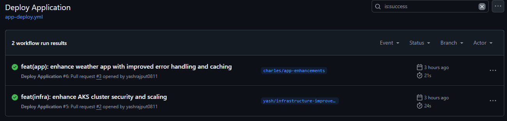
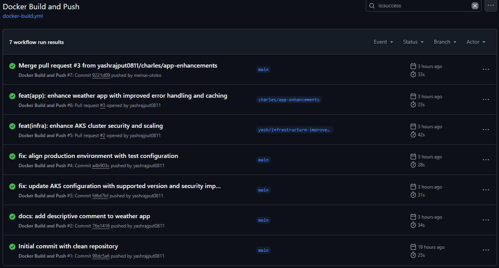
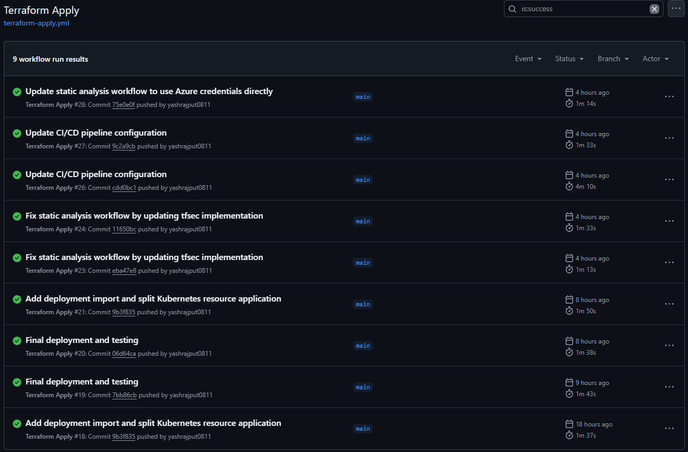

# CST8918 - DevOps: Infrastructure as Code Final Project

## Project Overview
This project implements Infrastructure as Code (IaC) using Terraform to deploy a Weather Application on Azure Kubernetes Service (AKS). The application provides real-time weather information with Redis caching for improved performance.

### Key Features
- Real-time weather data from OpenWeatherMap API
- Redis caching for improved performance
- Containerized application deployment
- Automated CI/CD pipeline
- Infrastructure as Code using Terraform
- Multi-environment setup (test and production)

## Team Members
- [Yash Rajput](https://github.com/yashrajput0811) - Infrastructure and DevOps Lead (AKS, Pipeline Configuration)
- [Caleb Watson-Danis](https://github.com/wats0358) - Security and CI/CD Pipeline Engineer
- [Pascal KC](https://github.com/meinai-otoko) - Kubernetes Configuration Specialist
- [Jatin Hooda](https://github.com/jatinhooda) - Documentation and Project Setup

## Key Contributions
- **Yash Rajput**: Led infrastructure setup, AKS configuration, and pipeline implementation
- **Caleb Watson-Danis**: Enhanced AKS security, implemented static analysis, and CI/CD pipeline improvements
- **Pascal KC**: Kubernetes configuration, Redis Cache setup, and AKS monitoring
- **Jatin Hooda**: Initial project setup and documentation

## Infrastructure Components
- **Azure Kubernetes Service (AKS)**
  - Separate clusters for test and production environments
  - Managed node pools with autoscaling
  - Azure CNI networking
- **Azure Container Registry (ACR)**
  - Private container registry for application images
  - Integrated with AKS
- **Azure Cache for Redis**
  - In-memory caching for weather data
  - Improved application performance
- **Azure Storage Account**
  - Terraform state management
  - Secure backend configuration

## Project Structure
```
.
├── app/                # Weather application source code
│   ├── index.js        # Main application file
│   ├── test.js         # Application tests
│   └── Dockerfile      # Container configuration
├── terraform/
│   ├── modules/
│   │   ├── backend/    # Azure Blob Storage configuration
│   │   ├── network/    # Network infrastructure
│   │   ├── aks/        # AKS cluster configuration
│   │   └── app/        # Application resources
│   └── environments/
│       ├── test/       # Test environment
│       └── prod/       # Production environment
└── .github/workflows/  # GitHub Actions workflows
```

## CI/CD Pipeline Status
The project implements three main pipelines:
1. **Static Analysis** - Code quality and security checks
2. **Terraform Apply** - Infrastructure deployment
3. **Application Deployment** - Container build and deployment

## Environment Variables
### Required Secrets
- `AZURE_CLIENT_ID`: Azure service principal client ID
- `AZURE_TENANT_ID`: Azure tenant ID
- `AZURE_SUBSCRIPTION_ID`: Azure subscription ID
- `AZURE_CLIENT_SECRET`: Azure service principal client secret
- `WEATHER_API_KEY`: OpenWeatherMap API key
- `REDIS_PASSWORD`: Azure Redis Cache password

## Setup Instructions
1. Clone the repository
2. Install required tools:
   - Azure CLI
   - Terraform
   - kubectl
   - Node.js
3. Configure Azure credentials
4. Set up GitHub secrets
5. Run the following commands:
   ```bash
   # Initialize Terraform
   cd terraform/environments/test
   terraform init
   
   # Deploy infrastructure
   terraform apply
   
   # Get AKS credentials
   az aks get-credentials --resource-group <resource-group> --name <cluster-name>
   ```

## Testing
- Unit tests for the weather application
- Infrastructure validation tests
- End-to-end deployment tests

## Monitoring and Logging
- Azure Monitor integration
- Log Analytics workspace
- AKS monitoring enabled

## Cleanup
To avoid Azure charges, run:
```bash
cd terraform/environments/test
terraform destroy
cd ../prod
terraform destroy
```

## Completed Actions workflows Screenshots

1. Deploy Application



2. Docker Build and Push



3. Terraform Apply



Last Updated: $(date +"%Y-%m-%d %H:%M:%S")
